# 1.研究背景
肺炎( Pneumonia)作为一种危害人类健康的常见疾病，在0~5岁婴幼儿以及65岁以上老年人的呼吸道疾病中尤为常见,且致死率逐年升高。根据世界卫生组织( World HealthOrganization,WHO)的统计,仅在2015年,因肺炎导致的儿童死亡人数就达到了92万人,占全世界五岁以下儿童死亡人数的16% [2]。在中国2000—2010年5岁以下儿童死亡原因中，肺炎排在第2位[3]。我国每年约有250万例肺炎发生,12万5千人因肺炎死亡,在各种致死病因中占第5位[“3,而由于老人年身体素质和免疫系统能力下降,在我国患有肺炎的人群中,老年人所占的比例就达到了70% [5]。
在传统肺炎诊断过程中,肺炎影像的判断主要依靠有经验的医生,但由于人工经验的差别准确率得不到保证[6]。随着计算机与数字图像处理技术的发展,计算机辅助诊断系统( Computer-Aided Diagnosis，CAD)[7]逐渐被引入临床,并为放射科医生判断CT图像提供参考意见。针对肺炎影像的自动识别问题,中外学者们提出了许多不同的方法。岳路等[8]利用决策树算法对200例小儿肺炎进行分类,取得了准确率80%的成绩。决策树(Decision Tree)是一种经典的机器学习分类方法,通过树形结构完成类型划分。决策树算法的优点是算法简单易于理解,可处理多种不同类型的分类问题,但是当数据量过大,容易产生过拟合问题,同时,在面对复杂数据时分类效果不是太好。Jun等[10]利用支持向量机(SupportVector Machine，SVM)算法["对间质性肺炎与非特异性肺炎进行分类,与放射科医生分类结果进行比较,准确率相差在5% ~6%。邵欣蔚[12]也利用SVM算法对儿童社区获得性肺炎(Community Acquired Pneumonia，CAP)进行分类,在早期诊断问题上取得了准确率90%的良好效果。SVM算法作为一种优秀的机器学习方法,利用高维映射解决了许多线性不可分问题,在图像、文本信息分类等方面取得了十分良好的效果,但当数据量过大时常常导致模型计算量过大、效率降低，鲁棒性与准确率得不到保证。近年来,随着人工智能和大数据应用的发展,计算机辅助诊断技术越来越多地被应用到临床。随着深度学习(Deep Learning)[3]这一概念的兴起,一大批以卷积神经网络(Convolutional Neural Network ，CNN)[14]为代表的深度学习方法开始出现。刘长征等[15]利用一个7层的卷积神经网络对400例肺炎患者的CT影像进行分类,识别准确率比SVM算法提高了5.7%。由于卷积神经网络“自主”学习的特性,避免了机器学习中人工提取图像特征的局限性,大幅度提高了识别准确率。为进一步提高卷积神经网络的识别准确率,通常的做法是增大数据集﹑增加神经网络层数。Rajpurkar 等116提出一种121层的卷积神经网络,在总量为112120张带标记的肺部X光图像数据集ChestX-ray14 上进行训练,在检测14种不同肺部疾病过程中,有11种取得了与放射科医生相似或更优的表现。
虽然通过增加网络层数获得了更加优异的分类效果,但是相应网络参数数量比浅层网络增加了几十甚至几百倍,内存占用也由几十兆提升至几百甚至上千兆,对系统资源的占用比浅层网络提高了很多。深度神经网络对系统性能较高的要求,给客户端部署造成了很大的阻碍,而采用浅层网络的训练结果往往不能够达到实际应用的要求。

# 2.分类效果演示
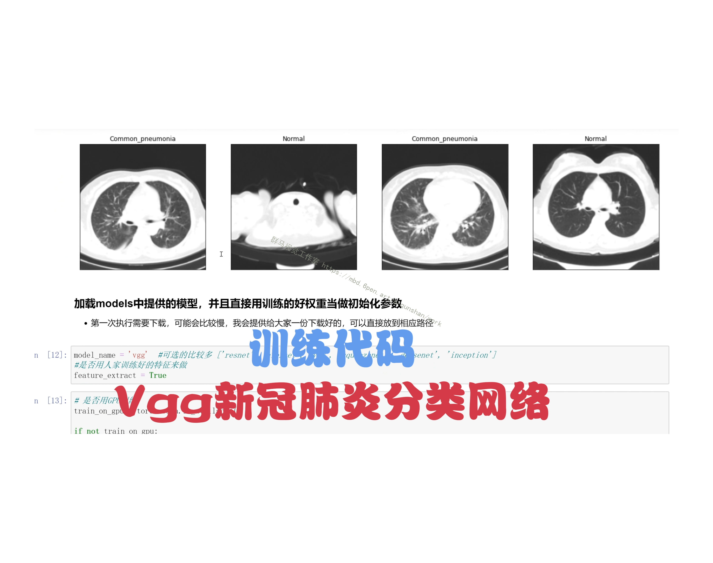

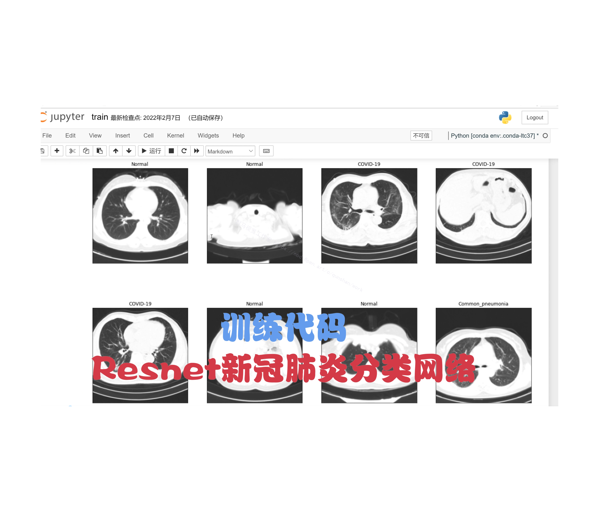

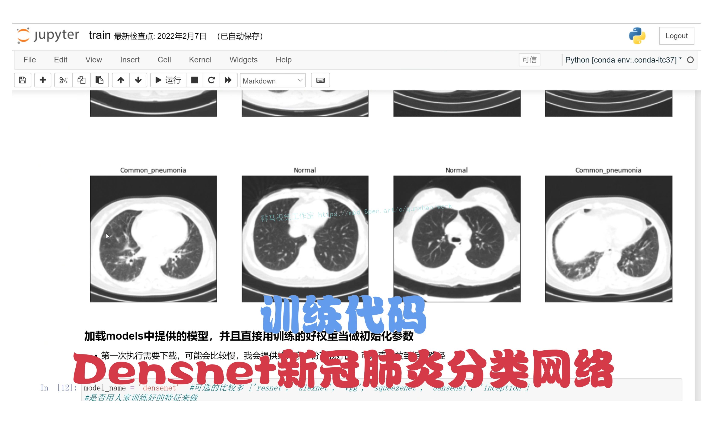

# 3.视频效果演示
[基于densnet＆resnet＆vgg的改进肺炎分类算法（源码＆教程）_哔哩哔哩_bilibili](https://www.bilibili.com/video/BV1Mg411m77H/?vd_source=bc9aec86d164b67a7004b996143742dc)


# 4.Resnet分类网络
ResNet 网络是在 2015年 由微软实验室提出，斩获当年ImageNet竞赛中分类任务第一名，目标检测第一名。获得COCO数据集中目标检测第一名，图像分割第一名。

在ResNet网络的创新点：

提出 Residual 结构（残差结构），并搭建超深的网络结构（可突破1000层）
使用 Batch Normalization 加速训练（丢弃dropout）
下图是ResNet34层模型的结构简图：
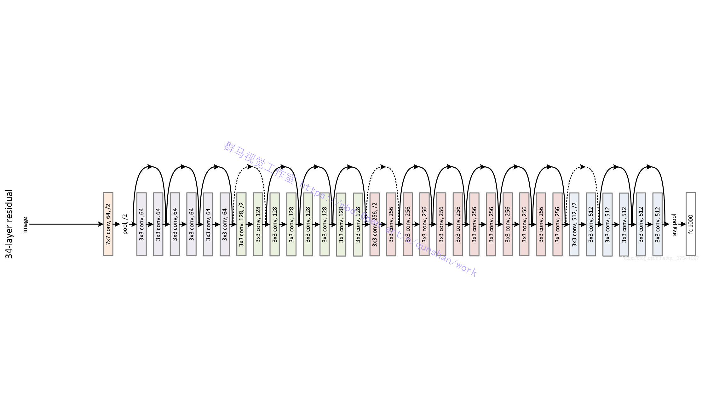
为了解决深层网络中的退化问题，可以人为地让神经网络某些层跳过下一层神经元的连接，隔层相连，弱化每层之间的强联系。这种神经网络被称为 残差网络 (ResNets)。

残差网络由许多隔层相连的神经元子模块组成，我们称之为 残差块 Residual block。单个残差块的结构如下图所示：
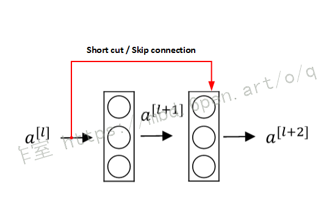
由多个 残差块 组成的神经网络就是 残差网络 。其结构如下图所示：
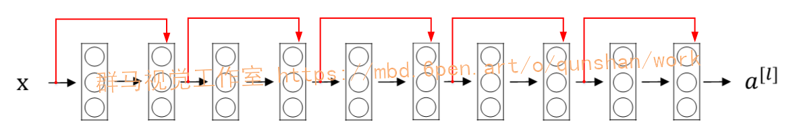
实际应用中，残差结构的 short cut 不一定是隔一层连接，也可以中间隔多层，ResNet所提出的残差网络中就是隔多层。

跟VggNet类似，ResNet也有多个不同层的版本，而残差结构也有两种对应浅层和深层网络：
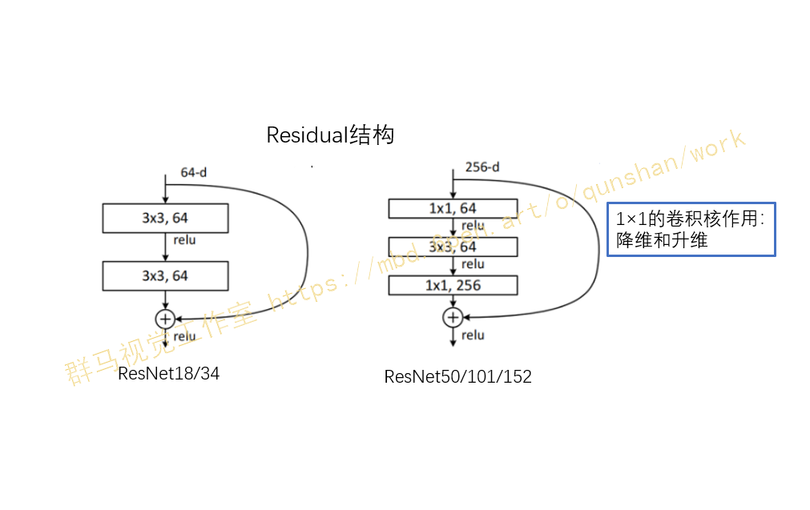

#### 代码实现
```
import torch.nn as nn
import torch


# ResNet18/34的残差结构，用的是2个3x3的卷积
class BasicBlock(nn.Module):
    expansion = 1  # 残差结构中，主分支的卷积核个数是否发生变化，不变则为1

    def __init__(self, in_channel, out_channel, stride=1, downsample=None):  # downsample对应虚线残差结构
        super(BasicBlock, self).__init__()
        self.conv1 = nn.Conv2d(in_channels=in_channel, out_channels=out_channel,
                               kernel_size=3, stride=stride, padding=1, bias=False)
        self.bn1 = nn.BatchNorm2d(out_channel)
        self.relu = nn.ReLU()
        self.conv2 = nn.Conv2d(in_channels=out_channel, out_channels=out_channel,
                               kernel_size=3, stride=1, padding=1, bias=False)
        self.bn2 = nn.BatchNorm2d(out_channel)
        self.downsample = downsample

    def forward(self, x):
        identity = x
        if self.downsample is not None:  # 虚线残差结构，需要下采样
            identity = self.downsample(x)  # 捷径分支 short cut

        out = self.conv1(x)
        out = self.bn1(out)
        out = self.relu(out)

        out = self.conv2(out)
        out = self.bn2(out)

        out += identity
        out = self.relu(out)

        return out

# ResNet50/101/152的残差结构，用的是1x1+3x3+1x1的卷积
class Bottleneck(nn.Module):
    expansion = 4  # 残差结构中第三层卷积核个数是第一/二层卷积核个数的4倍

    def __init__(self, in_channel, out_channel, stride=1, downsample=None):
        super(Bottleneck, self).__init__()
        self.conv1 = nn.Conv2d(in_channels=in_channel, out_channels=out_channel,
                               kernel_size=1, stride=1, bias=False)  # squeeze channels
        self.bn1 = nn.BatchNorm2d(out_channel)
        # -----------------------------------------
        self.conv2 = nn.Conv2d(in_channels=out_channel, out_channels=out_channel,
                               kernel_size=3, stride=stride, bias=False, padding=1)
        self.bn2 = nn.BatchNorm2d(out_channel)
        # -----------------------------------------
        self.conv3 = nn.Conv2d(in_channels=out_channel, out_channels=out_channel * self.expansion,
                               kernel_size=1, stride=1, bias=False)  # unsqueeze channels
        self.bn3 = nn.BatchNorm2d(out_channel * self.expansion)
        self.relu = nn.ReLU(inplace=True)
        self.downsample = downsample

    def forward(self, x):
        identity = x
        if self.downsample is not None:
            identity = self.downsample(x)  # 捷径分支 short cut

        out = self.conv1(x)
        out = self.bn1(out)
        out = self.relu(out)

        out = self.conv2(out)
        out = self.bn2(out)
        out = self.relu(out)

        out = self.conv3(out)
        out = self.bn3(out)

        out += identity
        out = self.relu(out)

        return out


class ResNet(nn.Module):
    # block = BasicBlock or Bottleneck
    # block_num为残差结构中conv2_x~conv5_x中残差块个数，是一个列表
    def __init__(self, block, blocks_num, num_classes=1000, include_top=True):
        super(ResNet, self).__init__()
        self.include_top = include_top
        self.in_channel = 64

        self.conv1 = nn.Conv2d(3, self.in_channel, kernel_size=7, stride=2,
                               padding=3, bias=False)
        self.bn1 = nn.BatchNorm2d(self.in_channel)
        self.relu = nn.ReLU(inplace=True)
        self.maxpool = nn.MaxPool2d(kernel_size=3, stride=2, padding=1)
        self.layer1 = self._make_layer(block, 64, blocks_num[0])             # conv2_x
        self.layer2 = self._make_layer(block, 128, blocks_num[1], stride=2)  # conv3_x
        self.layer3 = self._make_layer(block, 256, blocks_num[2], stride=2)  # conv4_x
        self.layer4 = self._make_layer(block, 512, blocks_num[3], stride=2)  # conv5_x
        if self.include_top:
            self.avgpool = nn.AdaptiveAvgPool2d((1, 1))  # output size = (1, 1)
            self.fc = nn.Linear(512 * block.expansion, num_classes)

        for m in self.modules():
            if isinstance(m, nn.Conv2d):
                nn.init.kaiming_normal_(m.weight, mode='fan_out', nonlinearity='relu')

    # channel为残差结构中第一层卷积核个数
    def _make_layer(self, block, channel, block_num, stride=1):
        downsample = None

        # ResNet50/101/152的残差结构，block.expansion=4
        if stride != 1 or self.in_channel != channel * block.expansion:
            downsample = nn.Sequential(
                nn.Conv2d(self.in_channel, channel * block.expansion, kernel_size=1, stride=stride, bias=False),
                nn.BatchNorm2d(channel * block.expansion))

        layers = []
        layers.append(block(self.in_channel, channel, downsample=downsample, stride=stride))
        self.in_channel = channel * block.expansion

        for _ in range(1, block_num):
            layers.append(block(self.in_channel, channel))

        return nn.Sequential(*layers)

    def forward(self, x):
        x = self.conv1(x)
        x = self.bn1(x)
        x = self.relu(x)
        x = self.maxpool(x)

        x = self.layer1(x)
        x = self.layer2(x)
        x = self.layer3(x)
        x = self.layer4(x)

        if self.include_top:
            x = self.avgpool(x)
            x = torch.flatten(x, 1)
            x = self.fc(x)

        return x


def resnet34(num_classes=1000, include_top=True):
    return ResNet(BasicBlock, [3, 4, 6, 3], num_classes=num_classes, include_top=include_top)


def resnet101(num_classes=1000, include_top=True):
    return ResNet(Bottleneck, [3, 4, 23, 3], num_classes=num_classes, include_top=include_top)

```

# 5.改进VGG分类网络
[参考该博客改进后VGG16相比AlexNet的一个改进是采用连续的几个3x3的卷积核代替AlexNet中的较大卷积核（11x11，7x7，5x5）](https://mbd.pub/o/bread/Y5iUlZdy)。对于给定的感受野（与输出有关的输入图片的局部大小），采用堆积的小卷积核是优于采用大的卷积核，因为多层非线性层可以增加网络深度来保证学习更复杂的模式，而且代价还比较小（参数更少）。
简单来说，在VGG中，使用了3个3x3卷积核来代替7x7卷积核，使用了2个3x3卷积核来代替5*5卷积核，这样做的主要目的是在保证具有相同感知野的条件下，提升了网络的深度，在一定程度上提升了神经网络的效果。
比如，3个步长为1的3x3卷积核的一层层叠加作用可看成一个大小为7的感受野（其实就表示3个3x3连续卷积相当于一个7x7卷积），其参数总量为 3x(9xC^2) ，如果直接使用7x7卷积核，其参数总量为 49xC^2 ，这里 C 指的是输入和输出的通道数。很明显，27xC^2小于49xC^2，即减少了参数；而且3x3卷积核有利于更好地保持图像性质。
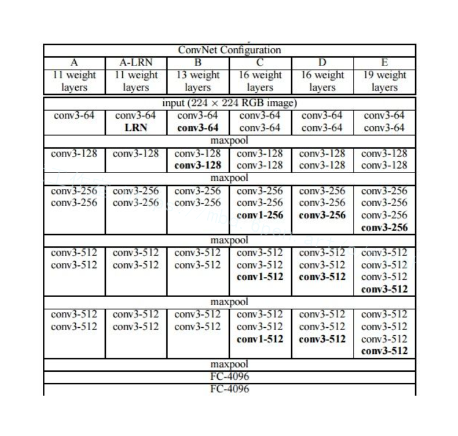


####代码实现
```
import torch.nn as nn
import torch
class VGG(nn.Module):
    def __init__(self, features, class_num=1000, init_weights=False):
        super(VGG, self).__init__()
        self.features = features
        self.classifier = nn.Sequential(      #分类网络结构
            nn.Dropout(p=0.5),                 #50%失活，减少过拟合
            nn.Linear(512*7*7, 2048),          #第一层全连接层，原论文是4096
            nn.ReLU(True),
            nn.Dropout(p=0.5),
            nn.Linear(2048, 2048),
            nn.ReLU(True),
            nn.Linear(2048, class_num)
        )
        if init_weights:      #是否初始化
            self._initialize_weights()
    def forward(self, x):     #前向传播
        # N x 3 x 224 x 224
        x = self.features(x)      #先提取特征
        # N x 512 x 7 x 7
        x = torch.flatten(x, start_dim=1)   #展平处理
        # N x 512*7*7
        x = self.classifier(x)    #分类网络
        return x
    def _initialize_weights(self):    #初始化权重函数
        for m in self.modules():
            if isinstance(m, nn.Conv2d):
                # nn.init.kaiming_normal_(m.weight, mode='fan_out', nonlinearity='relu')
                nn.init.xavier_uniform_(m.weight)   #xavier初始化方法
                if m.bias is not None:
                    nn.init.constant_(m.bias, 0)
            elif isinstance(m, nn.Linear):
                nn.init.xavier_uniform_(m.weight)
                # nn.init.normal_(m.weight, 0, 0.01)
                nn.init.constant_(m.bias, 0)
def make_features(cfg: list):    #提取特征的函数
    layers = []   #定义一个空列表
    in_channels = 3
    for v in cfg:     #遍历配置列表
        if v == "M":
            layers += [nn.MaxPool2d(kernel_size=2, stride=2)]
        else:
            conv2d = nn.Conv2d(in_channels, v, kernel_size=3, padding=1)
            layers += [conv2d, nn.ReLU(True)]
            in_channels = v   #改变深度
    return nn.Sequential(*layers)     #非关键字参数传入
cfgs = {    #对应不同配置的网络
    #数字代表卷积核个数，字母代表池化层参数
    'vgg11': [64, 'M', 128, 'M', 256, 256, 'M', 512, 512, 'M', 512, 512, 'M'],
    'vgg13': [64, 64, 'M', 128, 128, 'M', 256, 256, 'M', 512, 512, 'M', 512, 512, 'M'],
    'vgg16': [64, 64, 'M', 128, 128, 'M', 256, 256, 256, 'M', 512, 512, 512, 'M', 512, 512, 512, 'M'],
    'vgg19': [64, 64, 'M', 128, 128, 'M', 256, 256, 256, 256, 'M', 512, 512, 512, 512, 'M', 512, 512, 512, 512, 'M'],
}
def vgg(model_name="vgg16", **kwargs):    #实例化模型
    try:
        cfg = cfgs[model_name]    #传入字典
    except:
        print("Warning: model number {} not in cfgs dict!".format(model_name))
        exit(-1)
    model = VGG(make_features(cfg), **kwargs)   #1特征，2可变长度的字典变量，包含分类个数和是否初始化
    return model
```

# 6.Densnet分类网络

#### 网络结构加深的演变
到VGG时，网络的深度为19层，表现良好性能。但继续加深宽度性能并无提升，且参数计算量较大
使用shortcut连接。该连接方式是非常深的网络结构训练变得简单的关键因素。residual模块使用的就是shortcut连接（防止退化，最差是恒等映射）
(1)Stochastis depth(随机深度)被提出作为一种成功的训练1202层resnet的方式：在训练期间随机丢弃一些层来改善深层Resnet的训练。这总操作类似于dropout，增加网络的泛化性。但同时说明并不是所有的层都是必要的，有冗余层存在。
(2)另外，一些resnet的变种往往可以用更浅层的模型，达到和深层的模型差不多的性能，这些说明了现有更深的卷积神经网络学习得到的很多特征都是冗余的。
增加网络宽度也是一种提升网络效果的方法(Inception)。
DenseNet的优化方式（与增加宽度和深度不同）：特征复用。作者充分利用skip connection，让模块内的每一层接受它前面所有层的输出，增加了后续输入的变化并提高了效率。如此形成了更易训练、高效利用参数的浓缩结构。

#### Dense模块的介绍
密集连接卷积网络，它以前馈方式将每层的信息与后面其他层进行连接。模块内所有的层，都要接受前面所有层的信息。模块内部有L层，就有L(L+1)/2个连接。（注意：下图的L=5，由H1,H2,H3,H4,transition layer构成的）
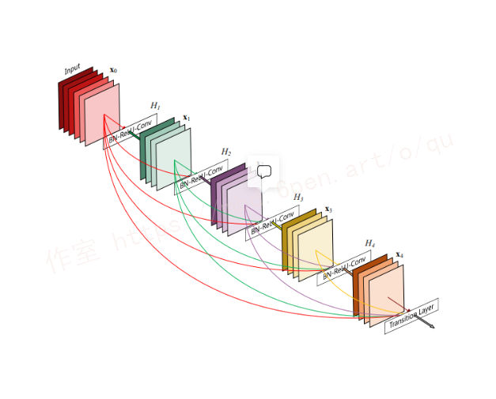

#### 参考[该博客的网络结构](https://afdian.net/item?plan_id=d5c883845c0e11edb71952540025c377)
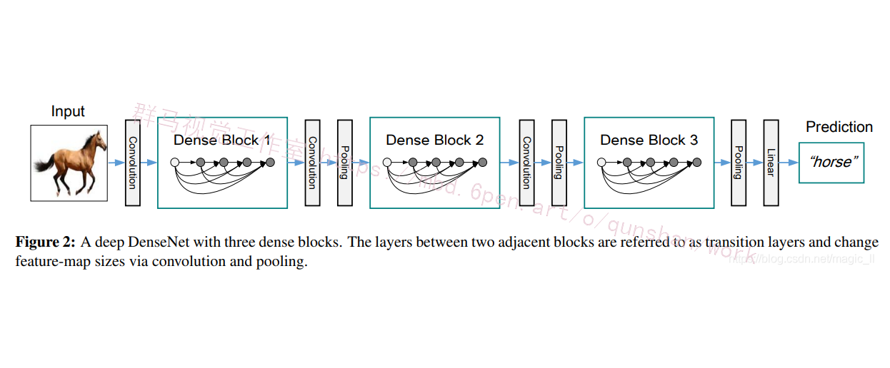

#### 代码实现
```
import re
import torch
import torch.nn as nn
import torch.nn.functional as F
import torch.utils.checkpoint as cp
from collections import OrderedDict
from utils import load_state_dict_from_url
from torch import Tensor
from torch.jit.annotations import List


__all__ = ['DenseNet', 'densenet121', 'densenet169', 'densenet201', 'densenet161']

# 对应模型预训练下载的地址
model_urls = {
    'densenet121': 'https://download.pytorch.org/models/densenet121-a639ec97.pth',
    'densenet169': 'https://download.pytorch.org/models/densenet169-b2777c0a.pth',
    'densenet201': 'https://download.pytorch.org/models/densenet201-c1103571.pth',
    'densenet161': 'https://download.pytorch.org/models/densenet161-8d451a50.pth',
}

#　step1:实现non-linear transformation:bn-relu-conv1x1-bn-relu-conv3x3
#　feature维度变化:       l*K->bn_size*k->k
#　传入参数有: num_input_features　输入特征数channel
# 　         growth_rate         输出特征数channel
# 　         bn_size             bottleneck结构需要先把k*l个通道变成4k个通道，用1x1conv变成k个通道，整体看来是一个降维过程
# 　         drop_rate           进行drop_out时的比例

class _DenseLayer(nn.Module):
    def __init__(self, num_input_features, growth_rate, bn_size, drop_rate, memory_efficient=False):
        super(_DenseLayer, self).__init__()
        self.add_module('norm1', nn.BatchNorm2d(num_input_features)),
        self.add_module('relu1', nn.ReLU(inplace=True)),
        # 　1x1conv降维到4k
        self.add_module('conv1', nn.Conv2d(num_input_features, bn_size *
                                           growth_rate, kernel_size=1, stride=1,
                                           bias=False)),
        self.add_module('norm2', nn.BatchNorm2d(bn_size * growth_rate)),
        self.add_module('relu2', nn.ReLU(inplace=True)),
        self.add_module('conv2', nn.Conv2d(bn_size * growth_rate, growth_rate,
                                           kernel_size=3, stride=1, padding=1,
                                           bias=False)),
        self.drop_rate = float(drop_rate)
        self.memory_efficient = memory_efficient

    def bn_function(self, inputs):
        # type: (List[Tensor]) -> Tensor
        concated_features = torch.cat(inputs, 1)
        bottleneck_output = self.conv1(self.relu1(self.norm1(concated_features)))  # noqa: T484
        return bottleneck_output


    # torchscript does not yet support *args, so we overload method
    # allowing it to take either a List[Tensor] or single Tensor
    def forward(self, input):  # noqa: F811
        if isinstance(input, Tensor):
            prev_features = [input]
        else:
            prev_features = input

        if self.memory_efficient and self.any_requires_grad(prev_features):
            if torch.jit.is_scripting():
                raise Exception("Memory Efficient not supported in JIT")

            bottleneck_output = self.call_checkpoint_bottleneck(prev_features)
        else:
            bottleneck_output = self.bn_function(prev_features)

        new_features = self.conv2(self.relu2(self.norm2(bottleneck_output)))
        if self.drop_rate > 0:
            new_features = F.dropout(new_features, p=self.drop_rate,
                                     training=self.training)
        return new_features


#　step3:根据non-linear transformation创建_DenseBlock
#　输入参数有：num_layers           DenseBlock里有多少个提取特征的“层”
#　          接下来这几个参数都是non-linear transformation需要的
#　          num_input_features   k0+k(l-1)
#　          bn_size              默认为4
#　          growth_rate          k
#　          drop_rate

class _DenseBlock(nn.ModuleDict):
    """DenseBlock"""
    _version = 2

    def __init__(self, num_layers, num_input_features, bn_size, growth_rate, drop_rate, memory_efficient=False):
        super(_DenseBlock, self).__init__()
        #　遍历num_layers，创建“层”
        for i in range(num_layers):
            #　i=0,输入为k0，输出为k
            #　i=1,输入为k0+k,输出为k
            #　i=2,输入为k0+2k,输出为k
            #　i=3,输入为k0+3k,输出为k
            #　...
            layer = _DenseLayer(
                num_input_features + i * growth_rate,
                growth_rate=growth_rate,
                bn_size=bn_size,
                drop_rate=drop_rate,
                memory_efficient=memory_efficient,
            )
            #　把“层”添加到序列模型中
            self.add_module('denselayer%d' % (i + 1), layer)

    def forward(self, init_features):
        features = [init_features]
        for name, layer in self.items():
            new_features = layer(features)
            features.append(new_features)
        return torch.cat(features, 1)


#　step2:实现连接两个DenseBlock的_Transition
#　输入参数有：num_input_feature    上一个DenseBlock的输出，(l-1)*k+k0
#            num_output_features  下一个DenseBlock的输入
class _Transition(nn.Sequential):  #继承Sequential类
    """Transition layer between two adjacent DenseBlock"""
    def __init__(self, num_input_features, num_output_features):
        super(_Transition, self).__init__()
        self.add_module('norm', nn.BatchNorm2d(num_input_features))
        self.add_module('relu', nn.ReLU(inplace=True))
        #　两个方向的降维度：channel降为num_output_features设定值
        # 　              featuremap降为一半AvgPool2d
        self.add_module('conv', nn.Conv2d(num_input_features, num_output_features,
                                          kernel_size=1, stride=1, bias=False))
        self.add_module('pool', nn.AvgPool2d(kernel_size=2, stride=2, ceil_mode=True))


#　step4:根据DenseBlock和transition创建DenseNet
#　输入参数有：growth_rate           每个denseblock输出维度k
#　          block_config          存放每个denseblock中有多少"层"(num_layers)
#　          num_init_features     初始卷积层输出channel数

class DenseNet(nn.Module):
    r"""Densenet-BC model class, based on
    `"Densely Connected Convolutional Networks" <https://arxiv.org/pdf/1608.06993.pdf>`_

    Args:
        growth_rate (int) - how many filters to add each layer (`k` in paper)
        block_config (list of 4 ints) - how many layers in each pooling block
        num_init_features (int) - the number of filters to learn in the first convolution layer
        bn_size (int) - multiplicative factor for number of bottle neck layers
          (i.e. bn_size * k features in the bottleneck layer)
        drop_rate (float) - dropout rate after each dense layer
        num_classes (int) - number of classification classes
        memory_efficient (bool) - If True, uses checkpointing. Much more memory efficient,
          but slower. Default: *False*. See `"paper" <https://arxiv.org/pdf/1707.06990.pdf>`_
    """

    def __init__(self, growth_rate=32, block_config=(6, 12, 24, 16),
                 num_init_features=64, bn_size=4, drop_rate=0, num_classes=1000, memory_efficient=False):

        super(DenseNet, self).__init__()

        #　初始卷积层，这个是独立于DenseBlock的
        #　7X7conv -> BN+Relu -> maxpool
        #　输出channel为num_init_features，featuremap需要计算（(n+2p-f)/s+1）
        # First convolution
        self.features = nn.Sequential(OrderedDict([
            ('conv0', nn.Conv2d(3, num_init_features, kernel_size=7, stride=2,
                                padding=3, bias=False)),
            ('norm0', nn.BatchNorm2d(num_init_features)),
            ('relu0', nn.ReLU(inplace=True)),
            ('pool0', nn.MaxPool2d(kernel_size=3, stride=2, padding=1)),
        ]))

        # Each denseblock
        # 根据block_config中的数据创建DenseBlock
        # 例如这里会创建四个DenseBlock，以第一个为例
        num_features = num_init_features
        for i, num_layers in enumerate(block_config):
            # num_layers为6，会创建6个“层”每层输入都是之前层输出的concat
            # i=0,输入为num_features，输出为k
            # i=1,输入为num_features+k,输出为k
            # i=2,输入为num_features+2k,输出为k
            # i=3,输入为num_features+3k,输出为k
            # ...
            block = _DenseBlock(
                num_layers=num_layers,
                num_input_features=num_features,
                bn_size=bn_size,
                growth_rate=growth_rate,
                drop_rate=drop_rate,
                memory_efficient=memory_efficient
            )
            # 把创建好的_DenseBlock接到最开始创建的序列模型后边
            self.features.add_module('denseblock%d' % (i + 1), block)
            num_features = num_features + num_layers * growth_rate
            # 如果不是最后一个DenseBlock，就需要创建transition连接
            if i != len(block_config) - 1:
                trans = _Transition(num_input_features=num_features,
                                    num_output_features=num_features // 2)
                self.features.add_module('transition%d' % (i + 1), trans)
                num_features = num_features // 2

        # Final batch norm
        self.features.add_module('norm5', nn.BatchNorm2d(num_features))

        # Linear layer  定义分类器
        self.classifier = nn.Linear(num_features, num_classes)

        # Official init from torch repo. 初始化权重
        for m in self.modules():
            if isinstance(m, nn.Conv2d):
                nn.init.kaiming_normal_(m.weight)
            elif isinstance(m, nn.BatchNorm2d):
                nn.init.constant_(m.weight, 1)
                nn.init.constant_(m.bias, 0)
            elif isinstance(m, nn.Linear):
                nn.init.constant_(m.bias, 0)
#前向传播
    def forward(self, x):
        features = self.features(x)
        out = F.relu(features, inplace=True)
        out = F.adaptive_avg_pool2d(out, (1, 1))
        out = torch.flatten(out, 1)
        out = self.classifier(out)
        return out


def _load_state_dict(model, model_url, progress):
    # '.'s are no longer allowed in module names, but previous _DenseLayer
    # has keys 'norm.1', 'relu.1', 'conv.1', 'norm.2', 'relu.2', 'conv.2'.
    # They are also in the checkpoints in model_urls. This pattern is used
    # to find such keys.
    pattern = re.compile(
        r'^(.*denselayer\d+\.(?:norm|relu|conv))\.((?:[12])\.(?:weight|bias|running_mean|running_var))$')

    state_dict = load_state_dict_from_url(model_url, progress=progress)
    for key in list(state_dict.keys()):
        res = pattern.match(key)
        if res:
            new_key = res.group(1) + res.group(2)
            state_dict[new_key] = state_dict[key]
            del state_dict[key]
    model.load_state_dict(state_dict)


def _densenet(arch, growth_rate, block_config, num_init_features, pretrained, progress,
              **kwargs):
    model = DenseNet(growth_rate, block_config, num_init_features, **kwargs)
    if pretrained:
        _load_state_dict(model, model_urls[arch], progress)
    return model


def densenet121(pretrained=False, progress=True, **kwargs):
    r"""Densenet-121 model from
    `"Densely Connected Convolutional Networks" <https://arxiv.org/pdf/1608.06993.pdf>`_

    Args:
        pretrained (bool): If True, returns a model pre-trained on ImageNet
        progress (bool): If True, displays a progress bar of the download to stderr
        memory_efficient (bool) - If True, uses checkpointing. Much more memory efficient,
          but slower. Default: *False*. See `"paper" <https://arxiv.org/pdf/1707.06990.pdf>`_
    """
    return _densenet('densenet121', 32, (6, 12, 24, 16), 64, pretrained, progress,
                     **kwargs)


def densenet161(pretrained=False, progress=True, **kwargs):
    r"""Densenet-161 model from
    `"Densely Connected Convolutional Networks" <https://arxiv.org/pdf/1608.06993.pdf>`_

    Args:
        pretrained (bool): If True, returns a model pre-trained on ImageNet
        progress (bool): If True, displays a progress bar of the download to stderr
        memory_efficient (bool) - If True, uses checkpointing. Much more memory efficient,
          but slower. Default: *False*. See `"paper" <https://arxiv.org/pdf/1707.06990.pdf>`_
    """
    return _densenet('densenet161', 48, (6, 12, 36, 24), 96, pretrained, progress,
                     **kwargs)


def densenet169(pretrained=False, progress=True, **kwargs):
    r"""Densenet-169 model from
    `"Densely Connected Convolutional Networks" <https://arxiv.org/pdf/1608.06993.pdf>`_

    Args:
        pretrained (bool): If True, returns a model pre-trained on ImageNet
        progress (bool): If True, displays a progress bar of the download to stderr
        memory_efficient (bool) - If True, uses checkpointing. Much more memory efficient,
          but slower. Default: *False*. See `"paper" <https://arxiv.org/pdf/1707.06990.pdf>`_
    """
    return _densenet('densenet169', 32, (6, 12, 32, 32), 64, pretrained, progress,
                     **kwargs)


def densenet201(pretrained=False, progress=True, **kwargs):
    r"""Densenet-201 model from
    `"Densely Connected Convolutional Networks" <https://arxiv.org/pdf/1608.06993.pdf>`_

    Args:
        pretrained (bool): If True, returns a model pre-trained on ImageNet
        progress (bool): If True, displays a progress bar of the download to stderr
        memory_efficient (bool) - If True, uses checkpointing. Much more memory efficient,
          but slower. Default: *False*. See `"paper" <https://arxiv.org/pdf/1707.06990.pdf>`_
    """
    return _densenet('densenet201', 32, (6, 12, 48, 32), 64, pretrained, progress,
                     **kwargs)

if __name__ == '__main__':
    # 'DenseNet', 'densenet121', 'densenet169', 'densenet201', 'densenet161'
    # Example
    net = densenet169()
    net_weights = net.state_dict()
    print(net)

```
# 7.肺炎分类数据集
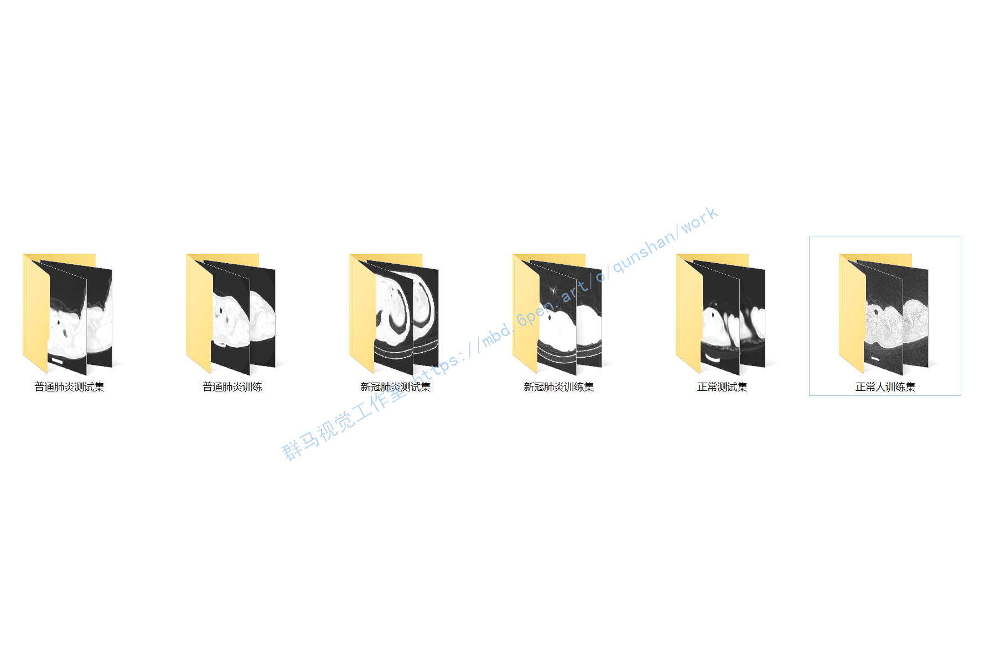


# 8.系统整合
下图[源码＆环境部署视频教程＆数据集](https://s.xiaocichang.com/s/0a1b3b)

参考博客[《基于densnet＆resnet＆vgg的改进肺炎分类算法（源码＆教程）》](https://mbd.pub/o/qunma/work)

# 9.参考文献
[1]刘长征,相文波.基于改进卷积神经网络的肺炎影像判别[J].计算机测量与控制.2017,(4).185-188.
[2]岳路,马凌燕,魏本征.基于决策树算法的小儿肺炎临床辨证分类模型研究[J].电子测试.2013,(5).243-244.
[3]冯江,袁秀琴,朱军,等.中国2000-2010年5岁以下儿童死亡率和死亡原因分析[J].中华流行病学杂志.2012,(6).558-561.
[4]朱迎钢,瞿介明.老年人重症肺炎的难点和临床对策[J].中华老年医学杂志.2008,(1).1-4.
[5]李方,方征.肺炎的分类[J].中国社区医师.1993,(11).16-17.
[6]邵欣蔚.基于SVM+算法的儿童社区获得性肺炎早期诊断研究[D].2017
[7]Dong, Jason,Sun, Xiaodong,Zhang, Kang,等.Identifying Medical Diagnoses and Treatable Diseases by Image-Based Deep Learning[J].Cell.2018,172(5).
[8]SangHoon Jun,BeomHee Park,Joon Beom Seo,等.Development of a Computer-Aided Differential Diagnosis System to Distinguish Between Usual Interstitial Pneumonia and Non-specific Interstitial Pneumonia Using Texture- and Shape-Based Hierarchical Classifiers on HRCT Images[J].Journal of digital imaging: the official journal of the Society for Computer Applications in Radiology.2018,31(2).235-244.DOI:10.1007/s10278-017-0018-y.
[9]Shiraishi J,Li Q,Appelbaum D,等.Computer-aided diagnosis and artificial intelligence in clinical imaging.[J].Seminars in Nuclear Medicine.2011,41(6).449-462.DOI:10.1053/j.semnuclmed.2011.06.004.
[10]佚名.A Survey on Transfer Learning[J].IEEE Transactions on Knowledge and Data Engineering.2010,22(10).1345.
[11]Hearst M.A.,Dumais S.T..Support vector machines[J].IEEE intelligent systems & their applications.1998,13(4).18-28.
[12]J.R.Quinlan.Induction of Decision Trees[J].Machine Learning.1986,1(1).81-106.

---
#### 如果您需要更详细的【源码和环境部署教程】，除了通过【系统整合】小节的链接获取之外，还可以通过邮箱以下途径获取:
#### 1.请先在GitHub上为该项目点赞（Star），编辑一封邮件，附上点赞的截图、项目的中文描述概述（About）以及您的用途需求，发送到我们的邮箱
#### sharecode@yeah.net
#### 2.我们收到邮件后会定期根据邮件的接收顺序将【完整源码和环境部署教程】发送到您的邮箱。
#### 【免责声明】本文来源于用户投稿，如果侵犯任何第三方的合法权益，可通过邮箱联系删除。